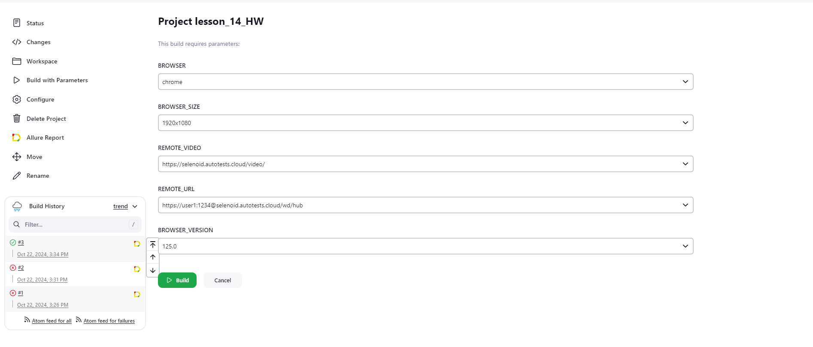
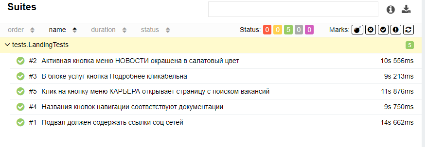
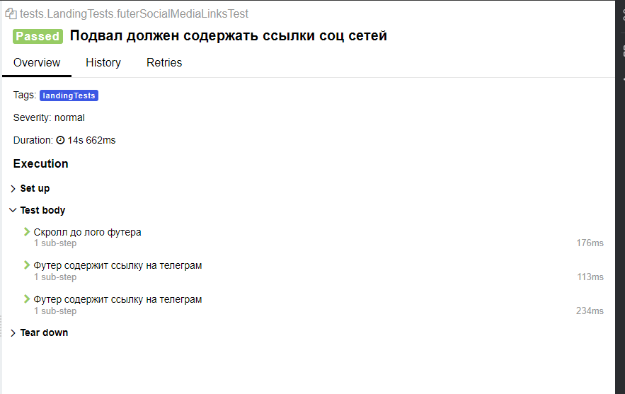
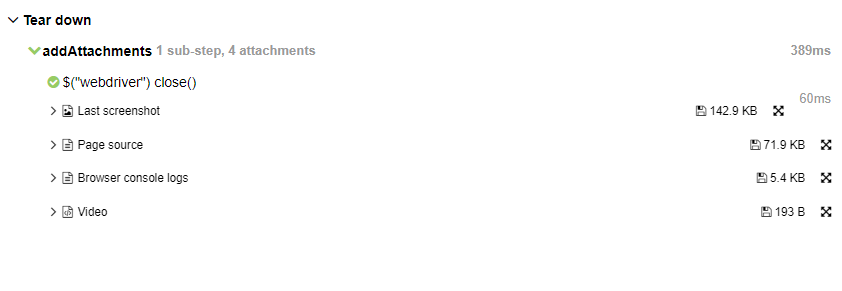
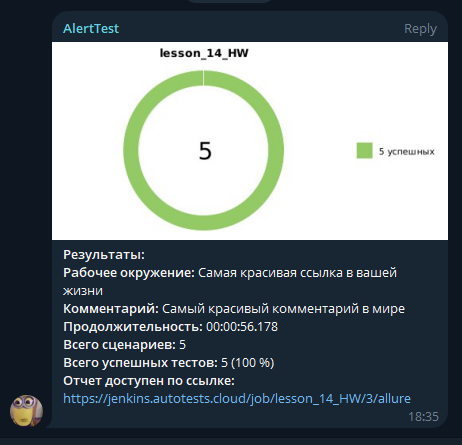
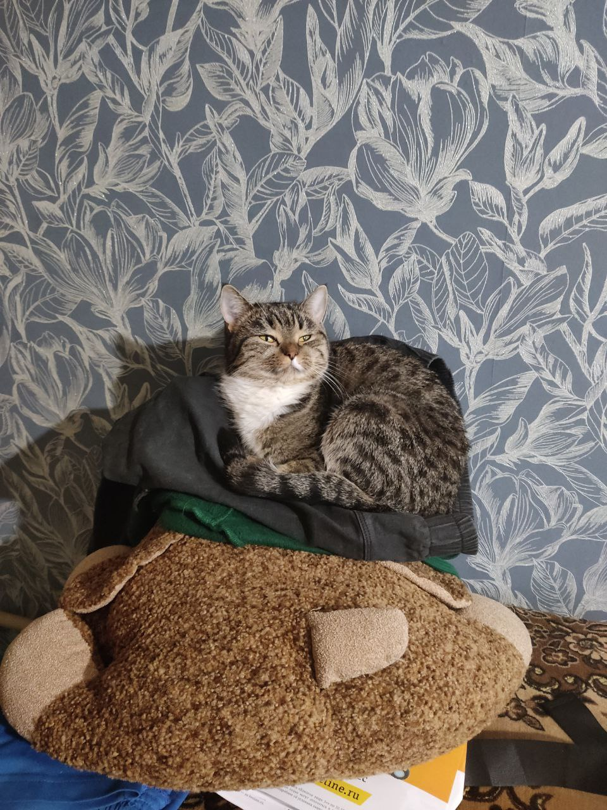

# Домашечка моя родимая

### Содержание

* <a href="#excuses">Оправдания</a>
* <a href="#info">А что же мы тут делаем?</a>
* <a href="#jenkins">Jenkins</a>
* <a href="#allure">Алюр отчетик</a>
* <a href="#bot">Ботец</a>
* <a href="#smile">А, ну и самое важное!</a>

---

### <a name="Добро пожаловать! В етом блоке я буду перед вами оправдываться">**Добро пожаловать! В етом блоке я буду перед вами оправдываться**</a>

Не велите казнить! Велите помиловать =) 

Работу я не ищу, поетому решила я тут немножко посвоевольничать и сделать ридми от которого айчар заплачет, письмо сожжет и вызовет мне екзорциста. Присаживайтесь мы начинаем >:F

---

### <a name="А что же мы тут делаем?">**А что же мы тут делаем?**</a>
Нашла я начится тут вакашку [тележке](https://t.me/qa_jobs/225119)    
Нафантазировала что мне дали тестовое задание напистаь на их сайт автотесты

---

### <a name="Jenkins">**Jenkins**</a>
Намутила Джобу в [Jenkins](https://jenkins.autotests.cloud/job/lesson_14_HW/)  

Теперь вы можете выбрать!   
- Бразуре!
- Разрешение экрана!
- Версию браузера!

А чтоб было удобно - все в двух екземплярах) ни в чем себе не отказываем!

---

### <a name="Отчетик, куда ж без него">**Отчетик, куда ж без него**</a>

И так, [тыкаем на кнопошку](https://jenkins.autotests.cloud/job/lesson_14_HW/3/allure/) и наслаждаемся перкрасным отчетом!
#### Хоть гдето я не шутила и нормально назвала кейсы

#### Не только кейсы, но и шаги мои прекрасны

#### Полный фарш у нас везде, и скриншотики, и видосики

PS Остальное смотрим по ссылочке выше)

---

### <a name="Ботец">**Ботец**</a>

Бота я конечно переиспользовала с предыдущих уроков, не бейте меня >_<

    

---

## Срочно улыбнись, котик в здании (Это кстати мой котик :3)

